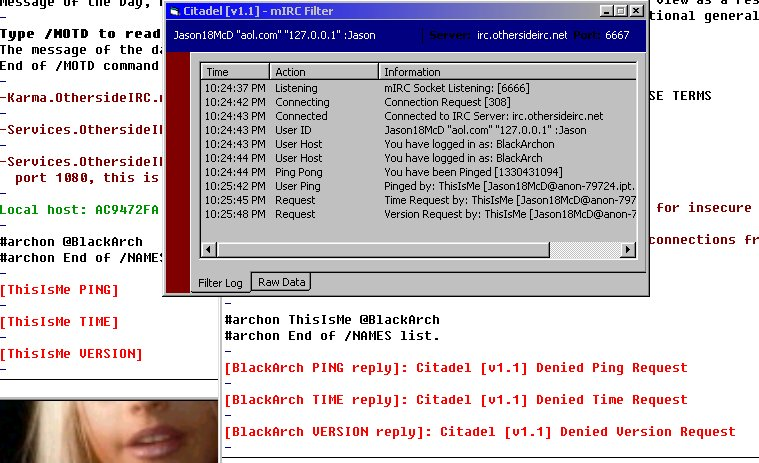



## mIRC Filter

### Description

mIRC Filter acts as a proxy between your client and the server. All the data passes between this application, and it parses out information and rebuilds strings to send to the server. This particular version deals with the basic IRC commands of Time, Ping and Version requests. Detects all Requests on your client and blocks them from the User trying to access. Normally, when you request someone's Time or Ping, it shows as '[Ping Request:] 1sec' in the person's console, we'll now, it will show '[Ping Request:] Citadel Blocked this Request'. Advanced Command parsing of the Data is almost finished and soon to be uploaded. Please read the 'Read Me' file attached, its not long at all.
 
### More Info
 

             |
---                |---
**Submitted On**   |2001-08-30 22:42:28
**By**             |[Genosyde](https://github.com/Planet-Source-Code/PSCIndex/blob/master/ByAuthor/genosyde.md)
**Level**          |Intermediate
**User Rating**    |5.0 (10 globes from 2 users)
**Compatibility**  |VB 5\.0, VB 6\.0
**Category**       |[Internet/ HTML](https://github.com/Planet-Source-Code/PSCIndex/blob/master/ByCategory/internet-html__1-34.md)
**World**          |[Visual Basic](https://github.com/Planet-Source-Code/PSCIndex/blob/master/ByWorld/visual-basic.md)
**Archive File**   |[mIRC Filte256418302001\.zip](https://github.com/Planet-Source-Code/genosyde-mirc-filter__1-26818/archive/master.zip)

